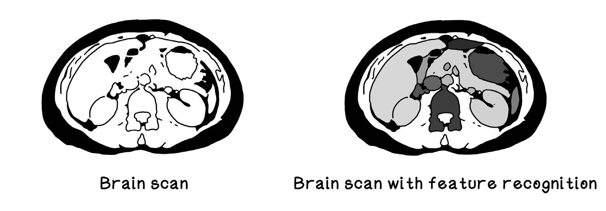

# 人工智能初印象
## 什么是人工智能？
+ 人工智能并没有**统一的概念**
+ 一般来说，对智能的定义是物体具有自动化的(autonomous)、自适应的(adaptive)的特征，二者分别指不需要持续的指导，以及当环境和问题空间变换时能够改变行为
+ 操作的核心元素即数据（包括使用数据、处理数据、根据数据做决策支撑等）
### 定义AI
> The true sign of intelligence is not knowledge, but imagination.
> -- -- by Albert Einstein 

本书中将AI广义地定义为呈现出智能行为的人造系统，下述有部分相应的表现举例：
+ 一个接连玩多种复杂游戏的系统
+ 一个癌症肿瘤检测系统
+ 一个基于较少输入生成艺术作品的系统
+ 一个自动驾驶的车辆

本书中涉及到的某些算法，在现在的视角来看，可能并没有与AI具有强关联，但它们都曾在历史上解决过复杂问题。
### 理解数据是智能算法的核心
数据作为[DIKW金字塔](https://www.ontotext.com/knowledgehub/fundamentals/dikw-pyramid/)(Data, Information, Knowledge, Wise)的根基，一定程度上决定了最终结果。

数据分为两类，定量数据和定性数据。

图1.1 我们身边的数据

在收集到**数据**，将其用于建立洞察性思维用于回答的问题的过程，正是创造**信息**的过程。而将**信息**与经验结合起来利用，并且有意识地应用，则是创造**知识**的过程。

图1.2 定量数据与定性数据

### 把算法看作“菜谱”
算法是一个指令和规则的集合，专门用于解决一个特定的问题。算法一般需要接受输入，并且经过几个阶段的有限步处理后，得到输出。
以阅读本书为例：
1. 找到这本书
2. 打开这本书
3. 当这本书还没有读完的时候
    1. 读一页
    2. 翻到下一页
    3. 想想你学到了什么
4. 思考如何把所学知识迁移到真实世界

算法就如同食谱一样，需要遵循特定的步骤。

图1.3 算法与食谱

以下为一个简单的猜数游戏算法，玩家的操作需要拆分成几步：

图1.4 猜数游戏算法

算法实际上是指令的集合，使用数据来创造可以展现智能行为并且解决困难问题的系统。

## 人工智能简史
AI并不是一个从天而降的想法。历史上有许多关于人造人和自动化“智能”机器的设想。实际上，现在的科学家也站在了巨人的肩膀上。

图1.5 人工智能演化史

## 问题类型与问题解决范式
问题通常按照**环境**和**语境**进行区分。
### 搜索问题：找到解决方案的路径
一个搜索问题通常是如下情况：包括一或多种可能的解决方案，每一种代表都面向目标前进的一系列步骤。

对**更优**(better)的解决方案的判定通常依赖于手边要解决的问题，而**更便宜**(cheaper)的解决方案则一般指的是更低的计算与执行成本。

### 优化问题：寻找一个好的解决方案
一个优化问题通常是如下情况：有非常多的有效解决方案，但是最优解很难找到。
> 局部最优与全局最优
> 解决方案往往存在于搜索空间中的散点中。局部最优即搜索空间中特定区域的最优解，而全局最优则是完整搜索空间中的最优解。数量关系为多对一。

### 预测和分类问题：从数据中的模式学习
预测是指我们有关于某物的数据并且希望去找到模式。

分类则是找到将数据中样例归入不同组别的模式，需要基于某物特征，尝试发现其对应的种类。

### 聚类问题：发现数据中的模式
聚类是从数据中发现趋势，希望找到数据中的关系，即使没有提出精确的问题（如散点属于哪一类别）。

### 确定性模型：每次计算结果都一致
对于确定性模型，给定指定输入，返回一个恒定的输出。

### 概率模型：可能重复计算结果不同
对于概率模型，给定指定输入，返回一个可能结果的集合。

## 人工智能概念的直观印象
实际上，智能存在多个级别，并且它们之间有着显著差异。

图1.6 人工智能的级别

### 弱人工智能：特定意图的解决方案
弱人工智能解决的是特殊情景或领域的问题，因为专精，所以不具备可迁移性。

但不同的弱人工智能可以通过一种合理的解决方案组合成更通用的人工智能。

### 通用人工智能：拟人的决策
通用人工智能是类人的智能，可以像人一样从不同的经历和交互中学习，并且将对一个问题的理解应用到其他的上去。

通用人工智能对人来说，不止于简单的归因，还包含记忆，基于视觉输入的空间归因，知识使用等等。达成通用人工智能也需要量子计算，数据处理，AI算法的突破。

### 超级人工智能：伟大的未知
人类能否创造超出我们本身的智能，尚且还是未知的。

对此问题的探讨哲学层面大过技术层面，实现还需要很长时间。

### 老AI和新AI
老AI通常理解成人们手动编码用于展现智能行为的算法规则，形成的系统。

新AI的意图则是创造可以从数据中学习或者创建独特的规则（人类需要它们创造的规则）的算法和模型。

区别在于后者可以从数据中发现重要的模式，而这是人类需要花费大量时间或者根本无法做到的。

图1.7 人工智能包含的概念分类

### 搜索算法
搜索算法用于解决需要几个动作来达成目标的问题，可以评估未来的状态，并且尝试找到通往最有价值的目标的最优路径。

### 仿生算法
通过从不同现象中观察和学习，我们理解了了关于有机系统如何操作以及简单规则如何作用于初期的智能行为。部分现象激发出了AI中的重要算法，如进化算法和群体智能算法。

进化算法的核心是种群会进行繁殖，基因的组合和突变会让后代比它们的祖先表现得更好。

群体智能算法则是指当愚钝的个体形成群体的时候，将会呈现出智能的行为。

### 机器学习算法
机器学习算法采用了统计学方法，来训练从数据中学习的模型。

机器学习中主要有三种方法：
+ 监督学习，指当训练数据具有已知种类的时候（对于某一特定问题），训练模型与算法
+ 非监督学习，用于揭示数据中隐藏的关系和结构，引领我们发起数据集相关的提问
+ 强化学习，受行为心理学启发，通过设立奖励，来对个体的有效行为做出反馈，并对不良行为施加惩罚

### 深度学习算法
深度学习的起源是机器学习，属于更广泛的方法和算法，用于达成弱人工智能，同时向通用人工智能迈步，如应用于计算机视觉和语音识别这样的广泛领域。

深度学习方法经常使用多个人工智能网络层，通过充分利用不同智能组成的网络，即每个层级负责特化的问题，合并起来统一解决复杂的问题，达成最终的目标。

## 人工智能算法的用途
哪里有数据和问题要解决，哪里就有AI的潜在应用。
### 农业：植物种植优化
农业作为人类赖以生存的根本，我们需要种植质量过关的作物以经济地满足巨大的消耗。目标正是在特定季节中，种植尽可能多的高质量作物。

使用作物的数据，我们可以充分利用机器来发现作物栽培中过程变量的模式和关系，以及发现对作物生长最重要的因素。结合智能算法，可以带来实时推荐和调整的使能，帮助最优化栽培。

图1.8 使用数据来优化作物种植

### 银行业：欺诈检测
不止银行，所有的金融机构都会面临欺诈。同时由于目前的金融服务跟互联网和私人设备关联紧密，漏洞带来的风险就更大。

通过交易数据，我们可以找到个体消费行为中表现出异常的模式。

### 网络安全：攻击检测与处理
互联网发展的一个副作用就是网络安全无法保障，不法者可以侵入服务商系统来获取数据。

通过使用AI，我们可以鉴别并且封锁服务器上潜在的攻击行为。

### 医疗：智能诊断
医疗一直是人类历史上重点关注的问题，传统医学中，医生经常需要观察扫描图片来监测肿瘤的存在，但是深度学习的发展可以有效改进。

AI可以用于寻找疾病、征兆、遗传基因等等的模式，在患者有较高概率得病时防患于未然。

图1.9 使用机器学习来识别脑部扫描中的特征

### 物流：路径规划与优化
物流企业一直具有巨大的市场，而对应的交通工具、配送地点、需求和截止日期都是各异的。

通过AI，我们可以实现以下三个步骤：
1. 找到两点之间的最短路（时间和空间上）
2. 基于交通模式、堵塞情况和道路种类来确定最优路径
3. 计算每个交通工具负责哪个包裹，走哪条路派送

### 通信：网络优化
通信产业在连接世界中起到了重要的作用，公司也需要支付昂贵的费用。

AI可以用于监控网络的行为，并对其路径做出优化。
### 游戏：主体创造
自从家用和个人电脑的普及，游戏一直是电脑系统的一个卖点。如果游戏复杂性够低，电脑可以穷尽所有可能性，来做出比人类更快的决策。

AI则是希望借此达成更通用的方法，可以使用于不同的情景。表面上看来游戏的AI算法没有那重要，但它可以推广应用到其他问题空间。

图1.10 使用神经网络来学习如何玩游戏

### 艺术：创造杰出作品
独特性是艺术家最看重的东西，他们通过自己的方式来表达周围的世界。

许多AI是用来做生成式艺术的，在符合原有参数的条件下，尽可能广泛地了解这个主题，并创造出全新的作品。

## 本章小结

