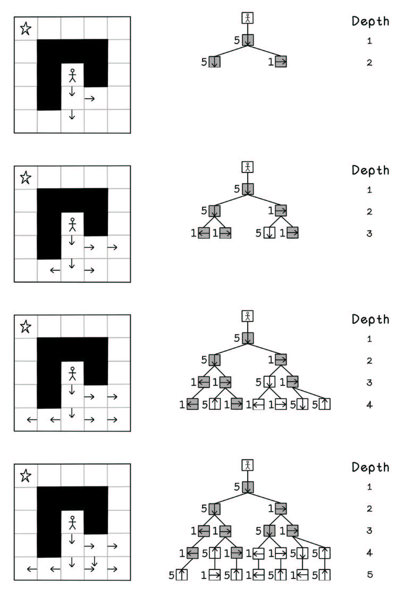
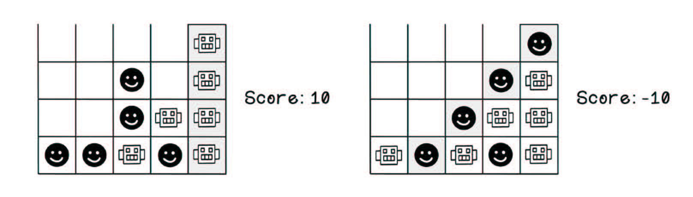

# 第三章 智能搜索
## 3.1 定义启发式方法：设计有根据的猜测
知情搜索：该算法具有需要解决的特定问题的一部分上下文
启发式方法是表示这种上下文的一种方法
一个启发式方法是用来评估某种状态的一条规则或一组规则，通常被描述为经验法则。它可用来定义某种状态必须满足的标准，或者用于衡量某个特定状态的表现
当无法使用寻找最优解的清晰方法时，我们通常选择使用启发式方法

考虑第2章中的迷宫场景，引入一个有趣的影响因素来演示创建启发式方法的概念：迷宫的重力场发生了一些奇怪的变化——现在向北或向南移动的成本是向东或向西移动的5倍（如图3.2）
图3.2 调整后的迷宫示例：重力场
在调整后的迷宫场景中，影响通向目标的最佳可能路径的因素包括在这条路径中需要移动的总步数，以及所有移动的成本之和
在图3.3中，搜索数中所有可能的路径已被表示出来，以突出显示可用的选项，并给出了相应移动所对应的成本。

图3.3 将所有可能的移动选项表示为一棵树
迷宫问题的一个典型的启发式方法为：“好的路径可使移动成本最小化，同时使达到目标的总移动量最小。”

## 3.2 知情搜索：在指导下寻求解决方案
:::info
知情搜索，也被称为启发式搜索，是一种结合一定智能，使用广度优先搜索或深度优先搜索方法寻求最优解方案的算法
:::
根据问题的性质，我们有一系列不同的知情搜索算法可以选择，其中也包括贪婪搜索（也被称为最佳优先搜索）。然而，最流行和最有用的知情搜索当属A^*^

### 3.2.1 A^*^搜索
A^*^搜索读作“A星搜索”
:::info
A^*^算法通常通过估算启发式来最小化下一个节点的访问成本，从而提高搜索算法的性能
:::
总成本通过两个指标来计算：一是从起始节点到当前节点的成本，二是节点n的启发式成本。当目标是最小化总成本时，较低的值表示性能更好的解决方案（如图3.4）

​    图3.4 A^*^搜索算法的相关函数
​    
下面的处理案例仅是一个抽象示例，意在说明如何在启发式的指导下访问搜索树。案例的重点是树中不同的启发式计算
广度优先搜索在移动到下一个深度之前，会完成对当前深度上的所有节点的访问。深度优先搜索在返回根节点并访问下一个路径之前，会访问当前路径上的所有节点（直至最深的那个节点）。而A^*^搜索有所不同，因为它没有一个预定义的模式可遵循；启发式成本将决定访问节点的顺序。
:::warning
:bulb: 注意， A^*^算法并非在一开始就知道所有节点的成本
:::
各个节点的成本是在搜索或生成树时计算的，每个访问过的节点都被添加到一个堆栈中，这意味着比已经访问的节点成本更高的节点将被忽略，以节省计算时间（见图3.5、图3.6和图3.7）*

    图3.5 使用A^*^搜索的树处理顺序（第1部分）*

    图3.6 使用A^*^搜索的树处理顺序（第2部分)*

    图3.7 A^*^搜索算法的流程

A^*^搜索的整体流程
1. **将根节点压入堆栈中**
2. **栈是空的吗？**
3. **返回“不存在通往目标的路径”**
4. **从堆栈中弹出一个节点**
5. **当前节点是否已被访问**
6. **将当前节点标记为已访问**
7. **是否到达目标节点？**
8. **基于当前节点返回解决方案路径**
9. **当前节点是否有令居节点？**
10. **按成本升序对堆栈中的节点进行排序**
11. **将当前节点设置为邻居节点的父节点**
12. **计算邻居节点的成本**
13. **将邻居节点加入堆栈**

类似于深度优先搜索，子节点的顺序会影响选择的路径，但影响较小。如果两个节点具有相同的成本，则第一个被计算的节点会被先访问（见图3.8、图3.9和图3.10）

:::warning
:bulb: 注意，虽然存在多种可达到目标的路径，但是在南北方向的移动成本更高的前提下， A^*^算法可在找到通过目标路径的同时将实现目标的成本降至最低，着意味着移动次数更少，平均移动成本也更低
:::

### 3.2.2 知情搜索算法的用例
知情搜索算法具有很强的通用性，并对那些可定义启发式的实际用例非常有用，例如：
+ *电子游戏中自主游戏角色的路径查找*
+ *在自然语言处理(NLP)中解析段落含义*
+ *电信网络路由选择*
+ *单人游戏和智力游戏*

## 3.3 对抗性搜索：在不断变化的环境中寻找解决方案
对抗性搜索的特点是对立或冲突。对抗性问题的解决方案要求预测、理解和抵抗对手为达到目标而采取的行动。关于对抗性问题，最典型的例子就是双人回合制游戏——如井字棋游戏和四子棋游戏。两个玩家轮流抓住机会来改变游戏场景的状态，使之对自己有利。预先设定的游戏规则规定了可用哪些可能的方案改变环境，以及何为获胜和最终状态

### 3.3.1 一个简单的对抗性问题
本节以四子棋游戏为例来探索对抗性问题。四子棋（如图3.11）是一种在网格棋盘上举行的游戏，玩家轮流将棋子下到棋盘上的某一列中

​    图3.11 四子棋游戏

### 3.3.2 最小-最大搜索：模拟行动并选择最好的未来
基于游戏中每个玩家可能采取的行动，最小-最大搜索(Min-max Search)算法旨在建立一棵由可能的结构构成的树，并选择对玩家最有利的路径，同时避免对对手有利的路径。为此，这种类型的搜索会模拟可能的移动，并在进行相应的移动后根据启发式对游戏状态进行评分。
最小-最大搜索尝试发现尽可能多的未来状态；但是由于内存空间和计算效率的限制，遍历整个游戏的状态树可能不太现实，所有它会搜索到制定的深度为止。最小-最大搜索尝试模拟每个玩家的游戏回合，所以指定的搜索深度直接和两个玩家之间的移动回合数相关

### 3.3.3 启发式
最小-最大算法利用启发式评分来作出决策。这个分数由精心设计的启发式定义的，而不是由算法学习得出的
假设有一个启发式，它提供一个正数优于负数的得分衡量标准。通过模拟每一个可能的有效移动，最小-最大搜索算法试图把那些会使对手具有优势或获胜的走法减到最少，并最大限度地增加能给玩家带来优势或使之获胜的走法
图3.12展示了一颗最小-最大搜索树。在此图中，只计算了叶节点的启发式得分，因为这些状态能代表获胜或平局的结果。搜索树的其他节点表示正在进行的游戏状态。从计算启发式得分的深度开始向上移动，要么选择得分最低的子节点，要么选择得分最高的子节点，这取决于在未来的模拟状态中谁走下一步。从顶部开始，玩家会尝试最大化其分数；在每一个交替回合之后，玩家的意图都会发生变化，因为最终目标是最大化自己的得分，最小化对手的得分
    图3.12 最小-最大搜索树的处理顺序

​    图3.12 最小-最大搜索树的处理顺序（续）
​    
因为最小-最大搜索算法会模拟所有可能的结果，在提供多种选择的游戏中，博弈树会爆炸式增长。

   图3.13 搜索博弈树时的可能性爆炸

现在，看一下在四子棋的例子中如何使用最小-最大搜索。从本质上来说，算法从当前游戏状态开始，对所有可能移动状态进行搜索；然后，从其中的每一个状态开始，搜索对手所有的可能移动状态；如此迭代，直到它找到最有利的路径。导致玩家获胜的游戏状态返回10分，导致对手获胜的游戏状态返回-10分。最小-最大搜索算法试图使玩家的正数得分最大化（图3.14和图3.15）

   图3.14 玩家得分与对手得分示意图

   图3.15 最小-最大搜索算法流程

最小-最大搜索算法的整体流程：
1. **给定：游戏状态、当前模式是MAX（最大化）还是MIN（最小化）、当前深度。算法可以开始了。**
2. **当前状态满足终止条件或深度为0吗？**
3. **返回当前分数和最后一步的移动**
4. **当前状态是MAX模式吗？**
5. **把当前已知最佳分数设置为正无穷大**
6. **把当前已知最佳分数设置为负无穷大**
7. **给定当前游戏状态，遍历所有移动方案**
8. **是否存在有效移动？**
9. **复制当前游戏状态，记为game_n**
10. **基于游戏状态game_n，记为game_n**
11. **将best_n设定为算法递归运行的结果**
12. **当前模式是否为MAX？**
13. **best_n是否小于已知最佳分数？**
14. **best_n是否大于已知最佳分数？**
15. **将已知最佳分数赋值为best_n**

在四子棋示例中，给定特点状态，最小-最大搜索算法将生成由可能的状态构成的树，如图3.16.从起始状态开始，算法尝试探索每一步可能的移动所导致的状态，然后从那个状态开始，对每一步移动所导致的状态展开迭代搜索，直至找到某个终止状态——要么棋盘满了，要么某个玩家赢了。

  图3.16 四子棋游戏中由可能的状态构成的树

图3.17以灰色背景突出显示终止所对应的节点，其中平局得分为0，败局得分为-10，胜局得分为10。因为该算法旨在最大化玩家得分，所有其启发式的目标需要用一个正数来表示，而对手的胜利则用负数得分来表示

  图3.17 四子棋游戏中可能的终止状态

当这些分数为已知时，最小-最大算法从最大深度开始，首先选择分数最低的节点（如图3.18）

    图3.18 四子棋游戏中终止专题的可能得分（第1部分）
    
然后，在下一深度，算法选择得分最高的节点（如图3.19）

    图3.19 四子棋游戏中终止状态的可能得分（第2部分)

在下一个深度，选择得分最低的节点；最后，根节点选择所有选项中的最大值。通过跟踪所选的节点和分数，并直观地将玩家角色代入问题中，发现该算法选择了一条通往平局的路径来避免损失。该算法假设对手总会以最聪明的举动来最大化他们的获胜的机会（如图3.20）

基于给定的游戏状态示例，图3.21用一棵简化了的博弈树来表示最小-最大搜索算法得分的结果。
    图3.20 四子棋游戏中终止状态的可能得分（第3部分)

    图3.21 简化的最小-最大算法得分的博弈树

### 3.3.4 阿尔法-贝塔剪枝：仅搜索合理的路径
开发人员常将阿尔法-贝塔剪枝这一技术与最小-最大搜索算法结合起来使用，以裁剪掉博弈树已知会产生不良解的区域。这一技术对最小-最大搜索算法进行优化，裁剪掉无关紧要的路径，能有效节省计算量（如图3.22）

​    图3.22 阿尔法-贝塔剪枝示例
​    
阿尔法-贝塔剪枝算法的工作原理：
将最大化得分玩家的最佳分数存储为$\alpha$（alpha，念作阿尔法），将最小化得分玩家的最佳分数存储为$\beta$（beta，念作贝塔）。算法开始时，将$\alpha$初始化为负无穷大，$\beta$初始化为正无穷大——每个玩家当前的分数都是最差的。如果最小化得分玩家的最佳分数小于最大化得分玩家的最佳分数，那么已访问节点的其他子路径将不会影响最佳分数
图3.23说明了最小-最大搜索流程中，阿尔法-贝塔剪枝算法所带来的改变。阿尔法-贝塔剪枝算法使最小-最大搜索算法流程 增加的步骤已突出显示

    图3.23 引入阿尔法-贝塔剪枝算法后最小-最大搜索算法的流程图

下面步骤是对最小-最大搜索算法的补充。设置了这些条件后，当新发现的最佳分数不会改变结果时，路径探索将终止
16. **当前是MAX模式吗？**
17. **best_n大于等于$\alpha$吗？**
18. **将best_n的值赋给$\alpha$**
19. **$\alpha$大于等于$\beta$吗？**
20. **best_n小于等于$\beta$吗？**
21. **将best_n的值赋给$\beta$**
22. **$\alpha$大于等于$\beta$吗？**

### 3.3.5 对抗搜索算法的典型案例
现实世界中，知情搜索算法具有较强的通用性，广泛应用于各种场景，例如：
+ *在具有完全信息的回合制游戏中创造智能玩家*
+ *在不具备完全信息的在具有完全信息的回合制游戏中创造智能玩家*
+ *针对路线优化的对抗性搜索和蚁群优化算法（ACO）

## 3.4 本章小结
知情搜索算法引入了更多的智能
尽管启发式往往难以设计，但一个好的启发式有助于更高效地找到解
A^*^搜索利用启发式与节点深度信息来寻找最优解

如果存在影响环境变化的因素，不妨试一试对抗搜索算法（如最小-最大算法）

通过裁剪次优路径，阿尔法-贝塔剪枝算法能对最小-最大搜索算法进行有效优化