# 第4章 进化算法
## 4.1 什么是进化？
:::info
进化论认为，通过繁殖活动，生物体生出混合基因（从亲本那里获得的基因）的后代，进而产生进化。考虑到这些个体在环境中的适应性，更强壮的个体有更高的生存可能性
:::
进化不是一个简单的线性过程，在不同的阶段会有不同的结果，整个过程要比我们想象的混乱得多

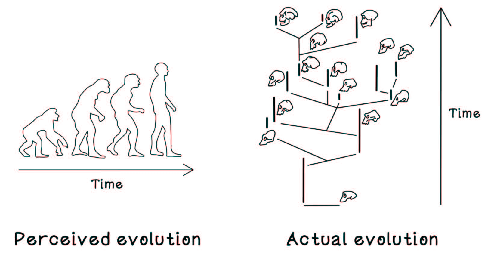

图4.1 以人类的进化为例对比线性进化与实际进化

查尔斯·达尔文提出了以自然选择为中心的进化论
自然选择：种群中更强壮的成员更有可能生产下来，因为它们更适合自己所生存的环境，这也意味着它们能繁殖更多的后代，并把有利于生存的特征传给后代——**这些后代可能会比它们的祖先表现更好**
在自然进化的例子中，我们可能会发现，不同个体之间的差异不仅在于颜色，还涉及其他方面的巨大变化，但实际上，这些变化是低级遗传差异通过许多代不断积累而形成的（图4.2）

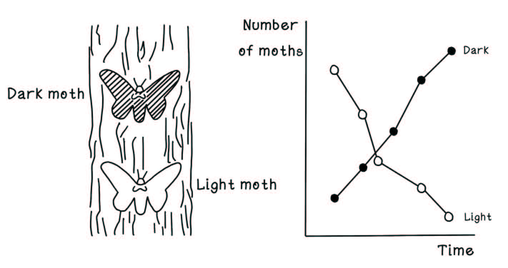

图4.2 胡椒蛾的进化过程

进化论包括这样一种观点：在一个物种的种群中，成对的生物体能够繁殖。繁殖所产生的后代基因来自亲本基因的组合，但通过一个名为突变的过程，后代的基因能够发生微小的变化。然后，后代成为种群的一部分。然而，并不是种群中所有个体都能将自己的基因传递下来。众所周知，疾病、伤痛或其他因素都会导致个体死亡。那些对周围环境适应性强的个体更有可能生存下去，这就产生了“适者生存”的说法。基于达尔文进化论，种群具有以下属性：
+ *多样性*
+ *遗传性*
+ *选择性*
+ *繁殖*
+ *交叉与突变*

科学家们借助生物进化涉及的知识来寻找实际问题的最佳解决方案：进化算法生成各式各样的解决方案，经过多次融合和迭代，最终尝试着收敛到某个表现更好的解决方案上
进化算法可单独使用，也可与神经网络等结构结合使用

## 4.2 适合用进化算法的问题
:::info
进化算法并不适用于所有问题，但它们在解决由大量排列或选择组成的优化问题时非常有效。这些问题通常有许多有效的解决方案，但其中一部分方案比另一部分更优
:::
考虑一下背包问题——计算机科学领域中用于研究算法的运行方式和执行效率的一个经典问题
在背包问题中，首先要给定某个背包所能承受的最大重量。此外，要给定一系列能装进背包中的物品，每样物品都具有不同的重量和价值。算法的目标是将尽可能多的物品放入背包以使总价值最大化，但放进背包的物品总重量不能超过背包的负重限制。在背包问题的最简单的设定中，暂且忽略物品大小、形状和尺寸（图4.4）

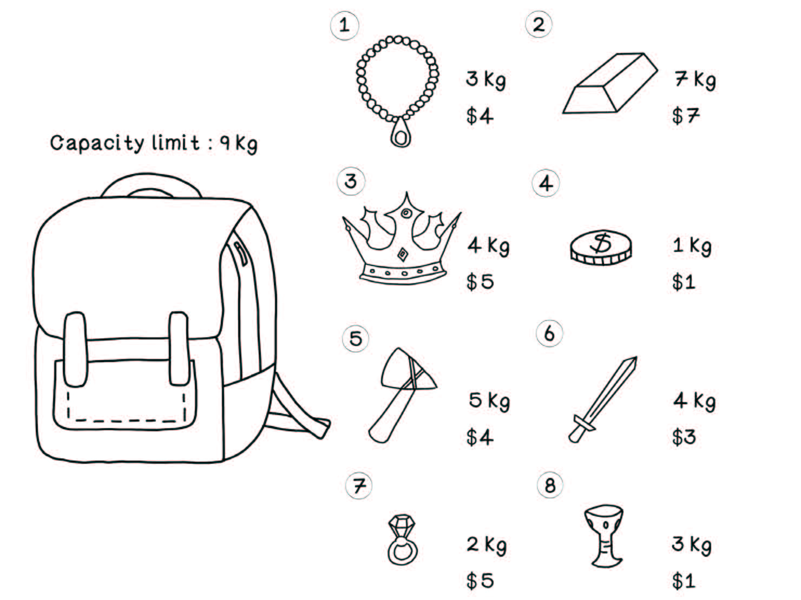

图4.4 背包问题的一个简单示例

按照表4.1中给定的问题描述，结合图4.4所示信息，现在有一个可承受9kg重量的背包，还有8个具备不同重量和价值的物品可供挑选。

这个问题有255种可能的解决方案，下面给出了几个典型的例子（图4.5）

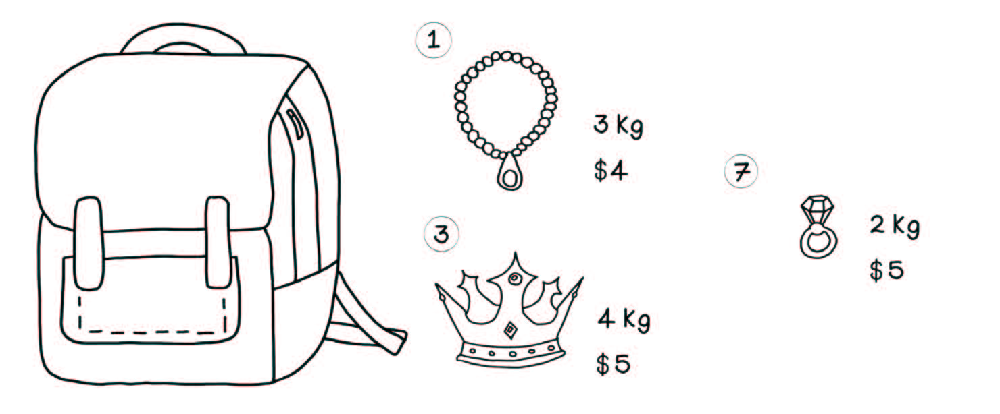

+ 解决方案1——包括物品1、物品4和物品6。总重量8kg，总值8美元

+ 解决方案2——包括物品1、物品3和物品7。总重量9kg，总值14美元

+ 解决方案3——包括物品2、物品3和物品6。总重量15kg，超出背包负重限制
  显然，总价值最高的解决方案是方案2。且随着物品数量的增加，潜在解决方案的数量会爆炸式增长
  :::warning
  :bulb: 注意，这里把能找到的最佳解决方案定性为理想解决方案，而不是最优解决方案
  :::
  虽然有些算法试图找到背包问题真正的最优解，但对进化算法而言，尽管它试图找到最优解，但不一定能找到。然而，这一说法将找到一个对当前问题来说可接受的解决方案——从主观上说，何为可接受的解决方案，取决于问题本身
  直观上，可使用暴力搜索算法来解决这个问题。图4.6显示了暴力搜索算法的一部分基准分析数据。这里的计算时间是基于普通个人电脑测出的
  
  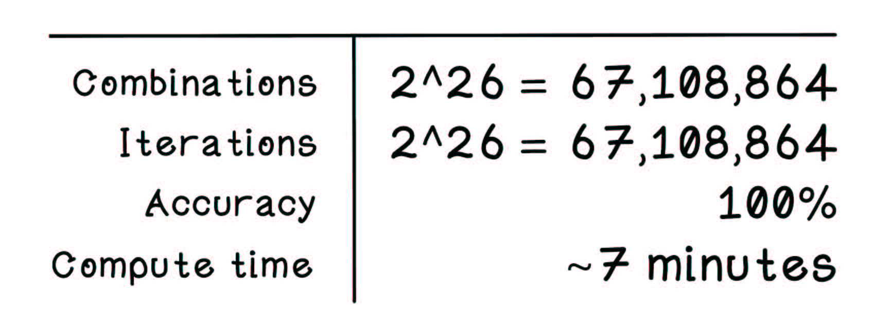
  
  
图4.6 用于解决上述背包问题的暴力搜索算法性能分析

:::warning
:bulb: 关于“性能”(performance)这一术语的注释：从单一解决方案的角度来看，性能是指该解决方案解决问题的能力和效果。从算法的角度来看，性能则是指在给定条件下某个算法寻找解决方案的能力。最后，性能也可能指计算复杂度。请记住，“性能”这一术语的含义因上下文而异
:::

使用遗传算法来解决背包问题背后的思想可应用于一系列的实际问题，例如：
+ 物流公司希望根据不同目的地来优化卡车运送策略
+ 该公司想找出一系列给定目的地之间的最短路线
+ 工厂通过传送带系统将物品精炼成原材料，并且物品的传送顺序会影响生产效率，那么遗传算法将会有助于确定物品顺序
注：遗传算法具有随机性，这意味着在每次运行时，算法都可能带来不同的输出

## 4.3 遗传算法的生命周期
遗传算法是进化算法簇中的一种特殊算法。进化算法簇的每种算法都在进化理论给出的相同前提下运行，但会在其生命周期的不同阶段作出一些微调，以适应不同的问题
遗传算法用于评估大的搜索空间，以寻求好的解决方案。值得注意的是，遗传算法并不能保证找到绝对意义上的最优解；当然，它试图寻找全局最优解，同时避免局部最优解
图4.7展示了全局最优解和局部最优解的一种分布，这里的算法目标是最小化解决方案。像遗传算法这样的优化算法旨在逐步寻找局部最优解，并迭代收敛到全局最优

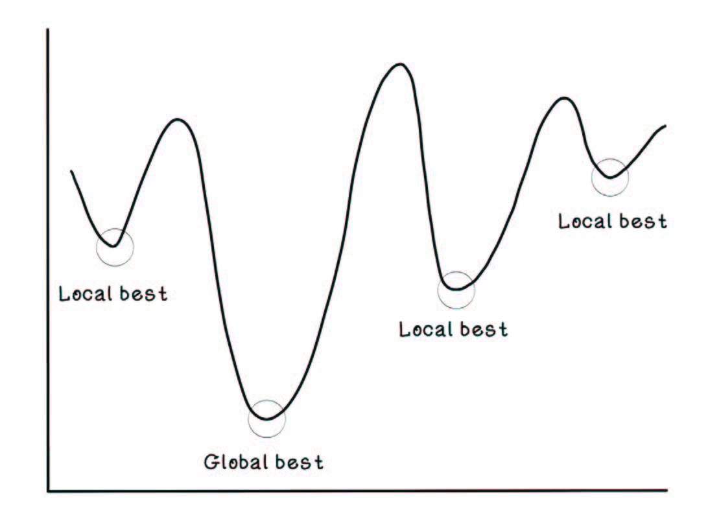

图4.7 局部最优解与全局最优解

在配置算法的参数时，需要格外谨慎；我们希望算法在开始时先尽可能获取多样化的解决方案，然后，通过每一代迭代逐渐向更好的解决方案靠拢。在算法开始阶段，备选解决方案在个体遗传属性上应该有很大差异。如果初始的解决方案缺乏多样化，那么陷入局部最优的风险就会增大（图4.8）

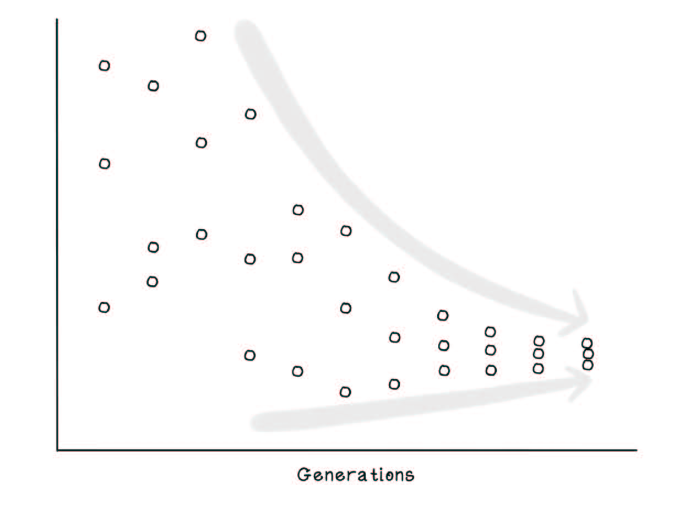

遗传算法的配置是基于问题空间的。每个问题都有其独特的上下文和表示数据的领域，评估其解决方案的方法也不同
一般来说，遗传算法的生命周期如下：

+ 创建一个种群

+ 衡量种群中个体的适应度

+ 根据适应度来选择亲本

+ 由亲本繁殖个体

+ 繁衍下一代
  遗传算法的实现需要一系列步骤。这些步骤构成了遗传算法生命周期的各个阶段（如图4.9）
  
  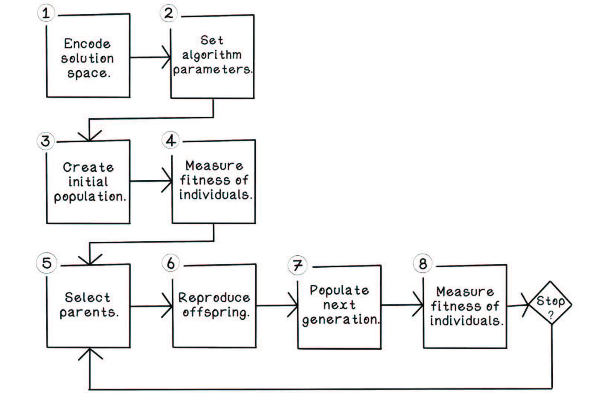
  
  
图4.9 遗传算法的生命周期

## 4.4 对解空间进行编码
使用遗传算法时，最重要的是正确地完成编码步骤，这需要仔细设计各种可能的状态表达。这里提到的状态是一种符合特定规则的数据结构，代表着问题的潜在解决方案。此外，状态的集合形成种群（图4.10）

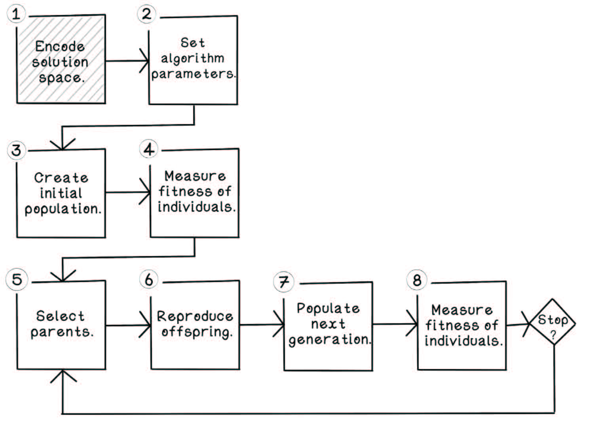

图4.10 对解空间进行编码

:::success
**术语解释**
就进化算法而言，单个候选解被称为染色体。染色体由基因组成。基因是构成染色体的特征单元的逻辑类型，等位基因是存储在对应单元的实际值。基因型是某一类解决方案的代表，而表现型特指某一个解决方案。染色体的集合形成一个种群，而种群中的染色体总是有相同数量的基因（图4.11）
:::
在背包问题中，有一系列不同的物品可装入背包。如果一个潜在的解决方案包含其中一部分物品但不包含其他物品，可采用二进制编码这一简单的方法来描述该解决方案（图4.12）。二进制编码用0来表示排除，即该位置对应的物品不会被装入背包；用1来表示包含，即该位置对应的物品被装入背包。完整描述背包问题解决方案的二进制字符串总是具有相同的长度，也就是说可供选择的物品数量始终不变

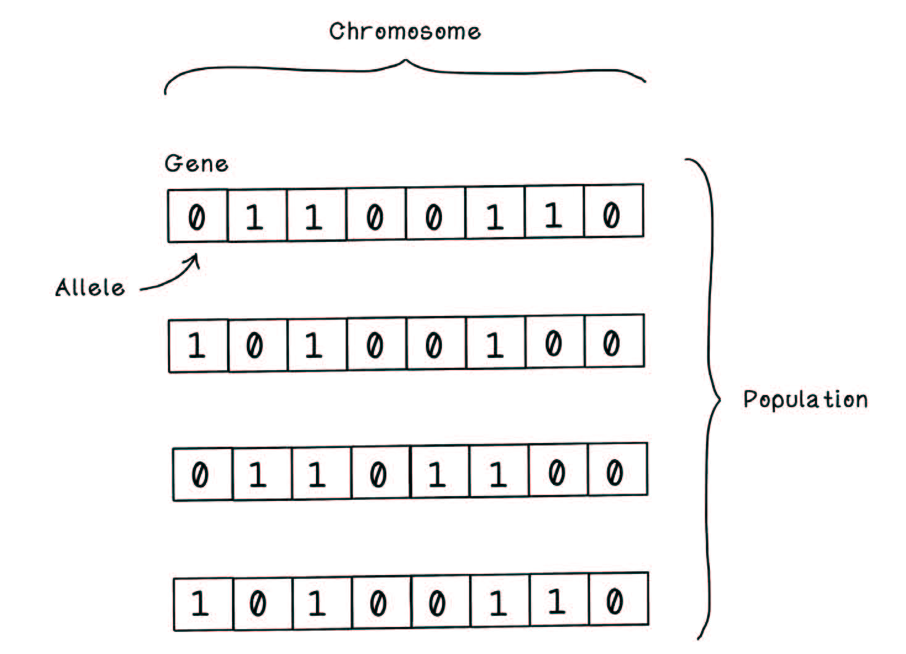图4.11 用于表达解决方案种群的数据结构术语示意

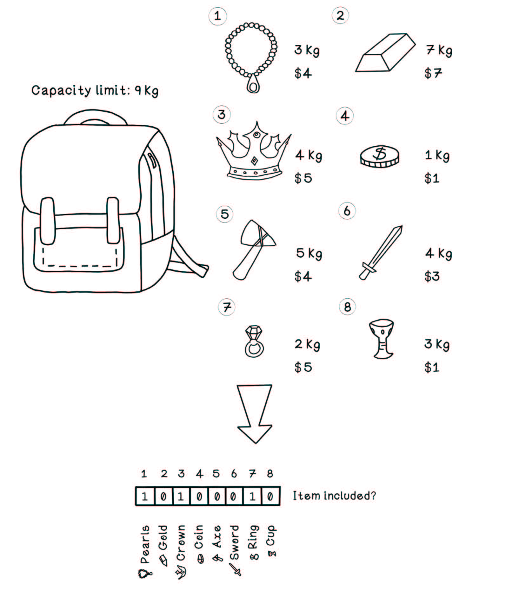

图4.12 背包问题的二进制编码示例

**二进制编码：用0和1表示可能的解决方案**
二进制编码用0或1来表示一个基因，所以染色体是由一串二进制来表示的。二进制编码可用多种方式表示某个特定元素的存在，甚至可将给定的任意数值编码为二进制数。
二进制编码的优点是：由于使用了基础计算单元类型，它通常具有更好的性能，使用二进制编码的解决方案对工作内存的需求更低；如能使用合适的编程语言，二进制运算能达到更快的计算速度
需确保设计的二进制编码对于给定的问题是有意义的，能很好地代表潜在的解决方案；否则，算法可能表现不佳（图4.13）

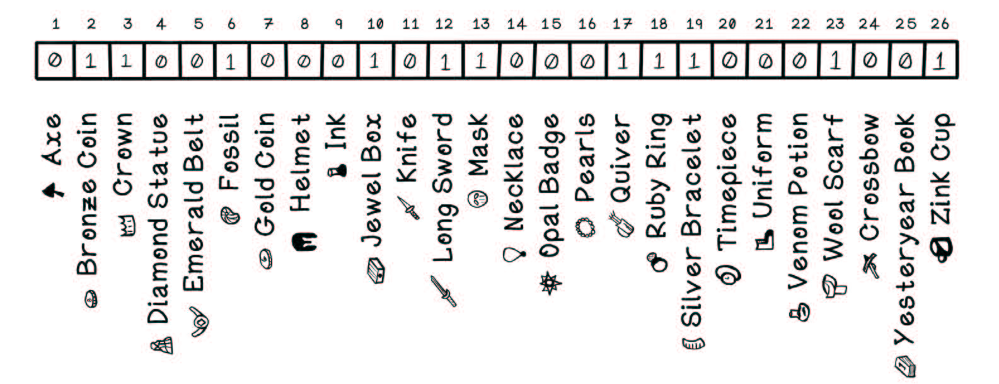

图4.13 对背包问题的较大数据集进行二进制编码

给定背包问题的数据集，其中包含26种具有不同重量和价值的物品，可用二进制字符串来表示每种物品是否被包含在背包中。结果是一个26位的字符串，对于字符串中的每个位置，0表示排除对应位代表的物品，1表示包含对应位代表的物品

## 4.5 创建解决方案种群
遗传算法的第一步是对该问题的随机潜在解进行初始化。在初始化种群的过程中，虽然染色体是随机生成的，但仍需考虑问题的约束条件；如果潜在解违法约束条件，那么它们将被赋予一个极低的适应度，否则，认为潜在解是有效的（图4.14）

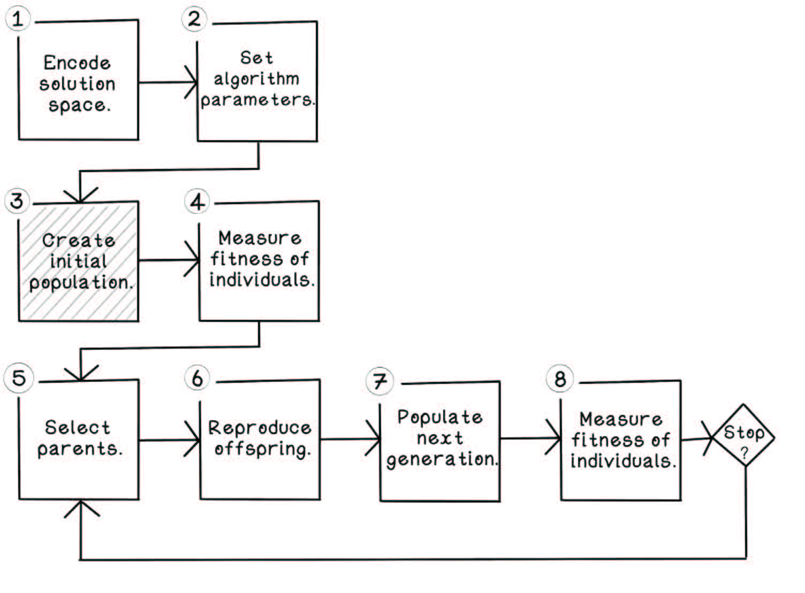

图4.14 初始化种群

确实如何表示背包问题的解决方案状态之后，该算法随机决定每种物品是否应该包含在背包中。如果简单地从左到右或从右到左遍历物品列表，它会偏向于染色体左侧或右侧的物品。为了避免这一问题，可先生成一个具有随机基因的完整解，然后检查它是否有效。若发现无效解，则为其分配一个极低的适应度（图4.15）

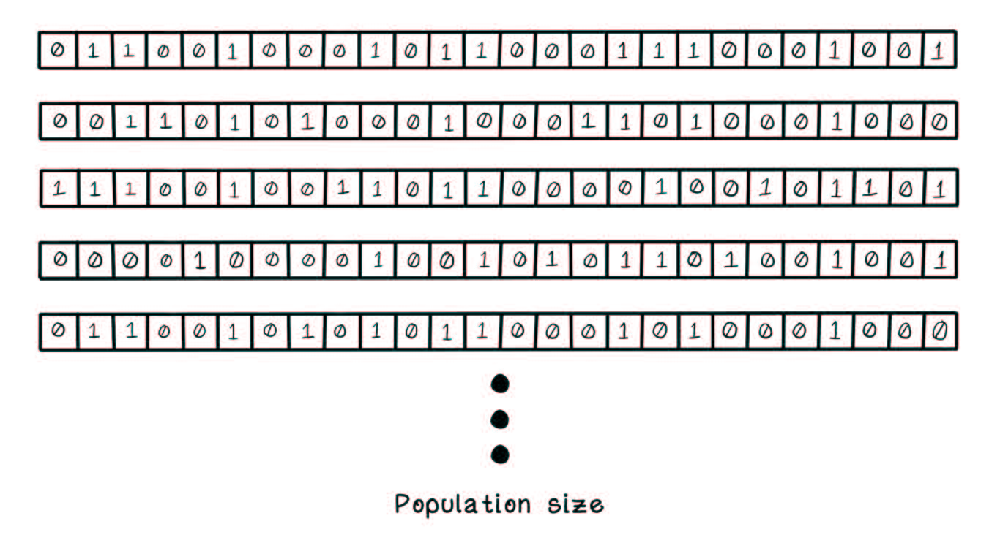

图4.15 解决方案种群示例

## 4.6 衡量种群中个体的适应度
完成种群的创建之后，需要确定种群中每个个体的适应度。适应度定义了个体所对应的解决方案的性能。适应度函数对遗传算法的生命周期至关重要
适应度函数类似于第3章中探索的启发式（图4.16）

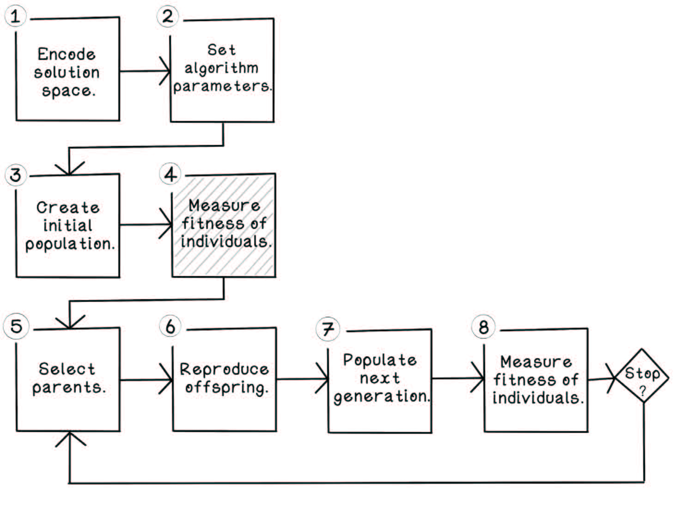

图4.16 衡量种群中个体的适应度

在本示例中，解决方案尝试最大化背包中物品的价值，同时需要遵守背包总负重限制的约束。适应度函数能衡量个体解决方案所对应的背包中物品的总价值。
注意，图4.17展示了一个无效的个体解决方案。因为这一解决方案对应的物品总重量超过了问题中设定的背包负重限制，它的适应度被设定为0

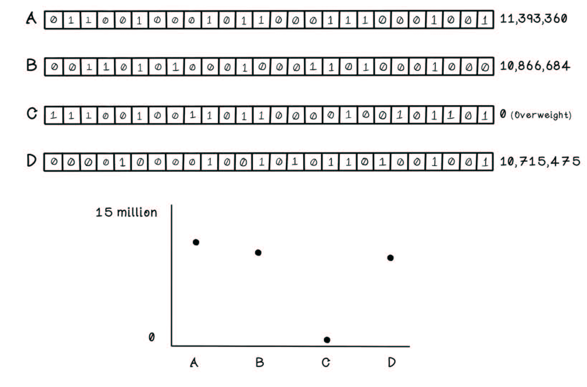

图4.17 衡量种群中个体的适应度

## 4.7 根据适应度得分筛选亲本
遗传算法的下一步是选择产生新的个体的亲本。每一个个体都有一个计算得出的适应度，用于确定它被选为新个体亲本的概率。这个属性使得遗传算法在本质上具有随机性（图4.18）

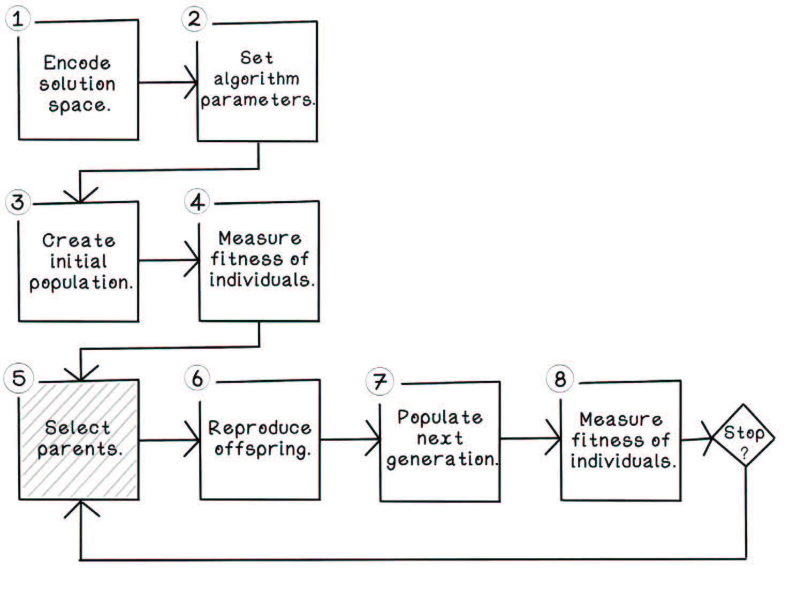

图4.18 筛选亲本

根据适应度来选择亲本的常用方法是“轮盘赌”：这种策略根据不同个体的适应度，在给定的轮盘上为其分配不同份额。然后“旋转”轮盘，根据指针所指的位置，选择一个个体。更高的适应度能让个体在轮盘上获得更大的份额。
不断重复这一过程，直到所选出的亲本数量达到期望
通过计算16个具有不同适应度的个体的概率，在轮盘是为每个个体分配一个扇形区域（图4.19）

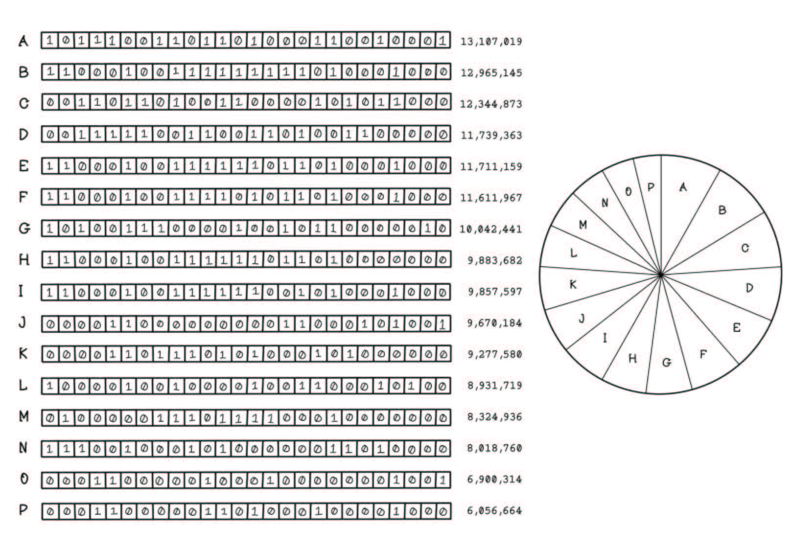

图4.19 确定每个个体被选中的概率

用于繁殖新后代的亲本的数量由预期的后代总数决定，也就是由每一代所需的种群规模决定。在每一次繁殖过程中，选择两个个体作为亲本，然后基于它们的基因创造后代。选择不同的亲本繁殖后代（同一个个体可能会不止一次地成为亲本），这个过程重复进行，直到产生所需数量的后代。根据算法设定，一对亲本可通过混合基因来繁衍一个个体，也可产生两个个体
种群模型是用于控制种群中个体基因多样性的方法。稳态模型和世代模型是两种各异利弊的种群模型

1. **稳态模型：每一代替换部分个体**
这种高层次的种群管理方法并非其他筛选策略的替代方案，而是关于如何使用具体筛选策略的方案。
稳态模型的思想是：保留种群中原有的大部分个体，只去掉一小部分较弱（适应度较低）的个体，代之以新的后代
2. **世代模型：每一代都替换全部个体**
和稳态模型类似，这种高层次的种群管理方法也是一种关于如何使用具体筛选策略的方案，而非其他筛选策略的替代方法
世代模型在繁殖过程中创建与种群规模相等的后代个体，并用新产生的后代来替换整个种群
3. **轮盘赌：筛选亲本和幸存个体**
适应度得分更高的染色体显然更容易被选中，但那些适应度较低的染色体仍有一定概率幸存下来
种群中的每个个体都有被选中的机会。某个个体被选中的概率将影响种群多样性和解决方案收敛速度，如图4.19所示

## 4.8 由亲本繁殖个体
完成了亲本的选择后，需要通过亲本的繁殖行为产生新的后代
一般而言，由亲本双方创造后代由两个步骤：
第一个概念是交叉，即把来自第一个亲本的一部分染色体和来自第二个亲本的一部分染色体混合，反之亦然。这个过程能产生两个后代，二者分别包含来自两个亲本的不同基因部分
第二个概念是突变，这意味着随机对后代的基因进行微调，从而在种群中产生基因型的突变（图4.20）

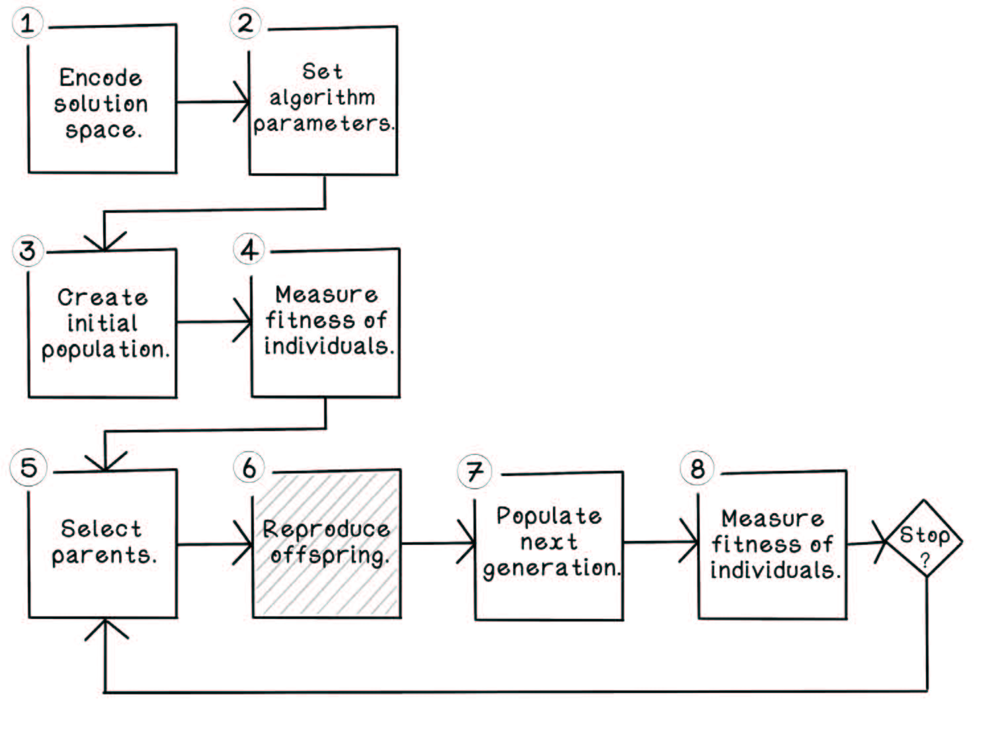

图4.20 繁殖后代

:::info
**交叉**
交叉是指混合来自两个个体的基因，以产生一个或多个后代个体。交叉这一词汇的灵感来源于生物繁衍的概念。后代个体的基因来自其亲本的染色体，具体取决于所使用的交叉策略。交叉策略在很大程度上受到所用编码方式的影响
:::

### 4.8.1 单点交叉：从每个亲本继承一部分
在单独交叉策略中：
首先选中染色体结构中的一个点作为染色体第一部分和第二部分的分界点；
然后按照前文所述的策略选出两个亲本，取第一个亲本染色体的第一部分，取第二个亲本染色体的第二部分；
将这两个部分结合在一起，就可以产生一个新的后代
与此类似。通过选取第二亲本的第一部分染色体和第一个亲本的第二部分染色体，将其混合，可产生第二个后代
单点交叉策略适用于二进制编码、顺序/置换编码和实值编码（图4.21）

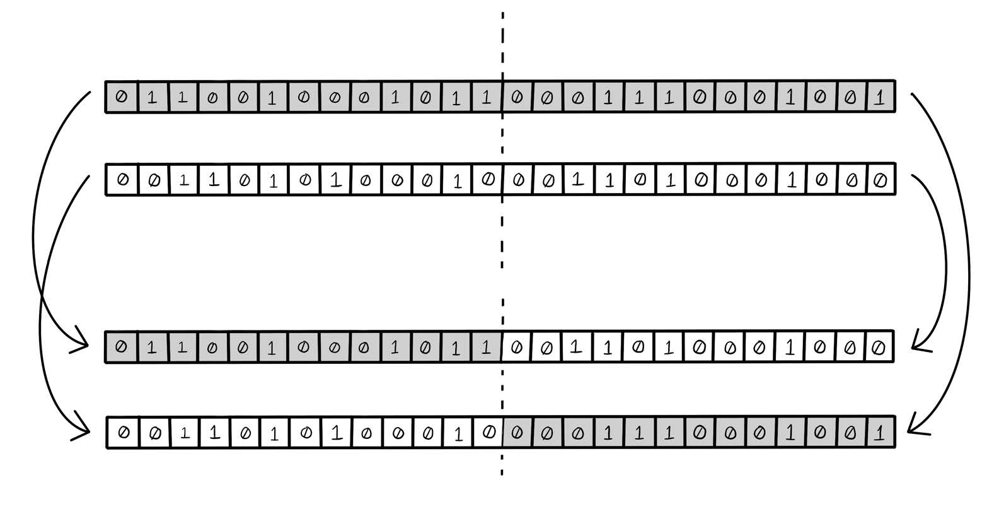

图4.21 单点交叉

### 4.8.2 多点交叉：从每个亲本继承多个部分
选择染色体结构的两个点；然后。根据前述问题中的两个亲本染色体，以交替的方式选择对应的染色体部分，以形成完整的后代个体。这个过程类似于单独交叉。
图4.22所示的案例：交叉所产生的后代由第一个亲本的第一部分、第二个亲本的第二部分、第一个亲本的第三部分组成。可将两点交叉想象成对不同数组进行拼接来创造新数组的过程。同样，可通过拼接亲代染色体的相反部分（第二个亲本的第一部分、第一个亲本的第二部分、第二个亲本的第三部分）来产生第二个后代个体。两点交叉适用于二进制编码和实值编码

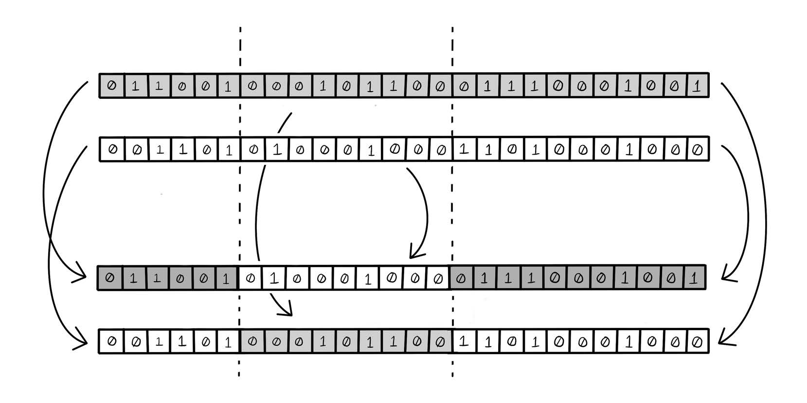

图4.22 两点交叉

### 4.8.3 均匀交叉：从每个亲本继承多个部分
均匀交叉比两点交叉的繁衍策略更科学、合理。在均匀交叉中，需要创建一个掩码，并且它代表每个亲本的哪些基因将用于产生后代，同理，这一过程的对称操作可用来创建第二个后代。每次创建子代时，不妨随机生成掩码，以最大化种群多样性。
一般而言，均匀交叉能创造更多样化的个体，因为后代的基因与他们的任何亲本相比都有很大的不同。均匀交叉适用于二进制编码和实值编码（图4.23）

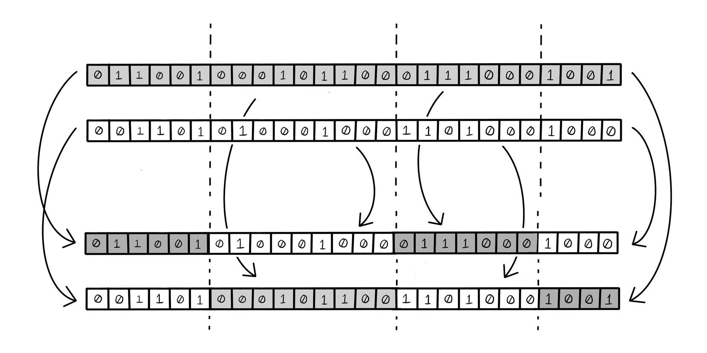

图4.23 均匀交叉

:::info
**突变**
突变是指对后代个体进行微调，以促进种群多样性的算法。根据问题的性质和编码方法，可选择一种合适的突变算法。
突变算法的一个重要参数是突变率——后代染色体上基因发生突变的可能性，与真实世界中的生物类似，一部分染色体比其他染色体更易突变；后代也并非其亲本染色体的精确组合，而会包含微小的遗传差异。基因突变对于促进种群多样性和防止算法陷入局部最优解至关重要
更高的突变率意味着个体发生突变的概率更高，或者说个体染色体中的基因发生突变的概率更高，这取决于突变策略。更多的突变意味着更高的种群多样性，但过高的多样性可能会导致和的解决方案发生退化
:::

### 4.8.4 二进制编码的位串突变
在位串突变中，随机选择二进制编码染色体的一个基因，并将其改为另一个有效值（图4.24）。当使用非二进制编码时，可考虑使用其他突变机制

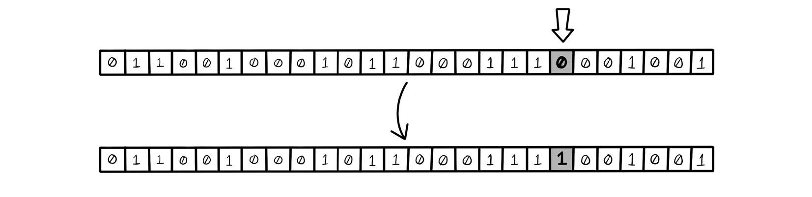

图4.24 位串突变

### 4.8.5 二进制编码的翻转位突变
翻转位突变方法将二进制编码染色体中的所有基因都翻转为相反的值。原本值为1的地方将变成0，而原本值为0的地方将变成1。这种类型的突变可能会显著降低那些性能良好的解决方案的质量，通常在需要持续性将多样性引入种群时使用（图4.25）

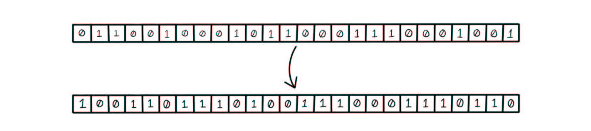

图4.25 翻转位突变

## 4.9 繁衍下一代
衡量了个体在种群中的适应度，并成功繁衍出后代以后，下一步是决定哪些个体继续生存到下一代。种群的规模通常是固定的。因为算法提高繁殖引入了更多的个体，所以种群中的一部分个体必须凋亡并从种群中移除
如果留下符合种群规模限制的最优秀的那部分个体，并淘汰其他个体，那么存活下来的个体在基因组成上相似，这种策略可能会造成基因多样性的停滞（图4.26）

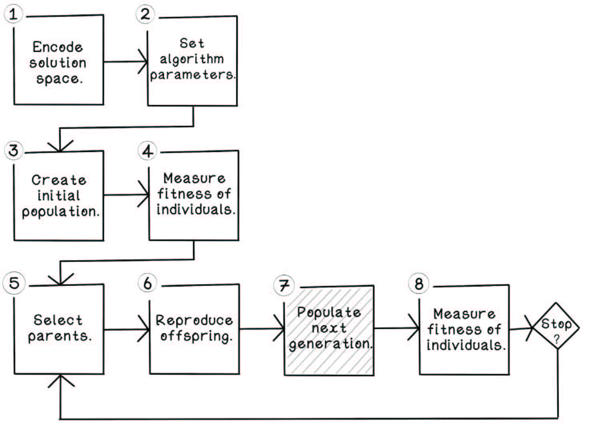

图4.26 繁衍下一代
    

### 4.9.1 探索与挖掘
遗传算法的执行总是需要在探索和挖掘之间取得平衡。理想的情况是：种群中的个体基因具有较高的多样性，而且整个群体能在搜索空间中寻找完全不同的潜在解决方案，然后利用更强的局部解空间来找到最理想的解
这种情况的美妙之处在于，算法探索了尽可能多的搜索空间，同时随着个体的进化。利用其中更强的那部分解决方案来寻找更好的解（图4.27）

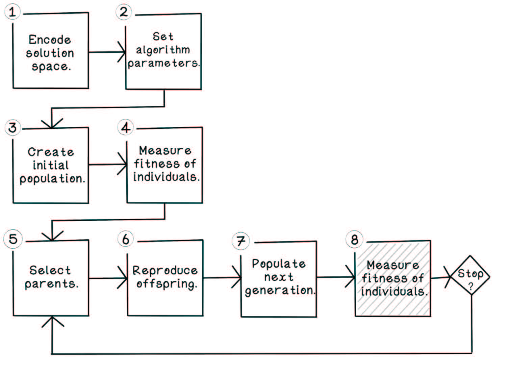

图4.27 衡量个体适应度
    

### 4.9.2 停止条件
因为遗传算法通过不断迭代来寻找更好的解，所以我们需要为其设定停止条件；否则，算法可能会永远运行下去。停止条件是算法结束时需要满足的条件；当算法结束时，当代种群中的最强的个体（适应度最高的个体）被选为最优解
最简单的停止条件可以是一个常数——一个用于控制算法迭代次数的整数
另一种方法是在种群中的个体达到一定的适应度时停止运行。当已知所需的最小适应度，但是并不知道这一适应度所对应的解决方案时，可采用这种方法
停滞是进化算法中存在的一个不可忽略的问题。**停滞**指的是在进化算法中，种群连续几代产生适应度相似的解。如果种群中的个体的进化停滞不前，那么在未来几代产生表现更好的解决方案的可能性将很低。停止条件的设定也可着眼于每一代中最佳个体适应度的变化，如果发现适应度变化很小，则选择停止算法

## 4.10 遗传算法的参数配置
在设计遗传算法并配置其参数时，需要作出几个对算法性能产生影响的决定
性能方面的关注点主要有两个：从精度的角度来看，算法应该致力于寻找当前问题的最佳解决方案；从计算效率的角度来看，算法应该能被高效地执行
采用的编码方式、适应度函数以及遗传算法中设定的其他参数，都会对算法的精度和效率产生影响。为了在寻找良好的解决方案的同时保证计算效率，需要考虑以下参数：
+ *染色体编码方式*
+ *种群规模*
+ *种群初始化*
+ *后代数量*
+ *亲本筛选方法*
+ *交叉方法*
+ *突变率*
+ *突变方法*
+ *世代筛选方法*
+ *停止条件*

## 进化算法的原理
进化算法可独立解决问题，也可与其他技术相结合，创造出解决问题的新方法
+ *预测投资者在股市中的行为*
+ *机器学习中的特征选择*
+ *密码破解和密文*

## 4.12 本章小结
遗传算法巧妙利用随机性以快速收敛到好的解决方案
对遗传算法来说，编码方法是一切的核心

给定当前问题，适应度函数对于找到最优解而言至关重要
交叉方法试图基于每一次迭代生成更好的解决方案

为了最终获得表现更好的解决方案，筛选策略会给那些适应度得分更高的个体更多的机会，同时适应度得分较低的个体一定的存货概率

开始时偏重探索，后期偏重挖掘