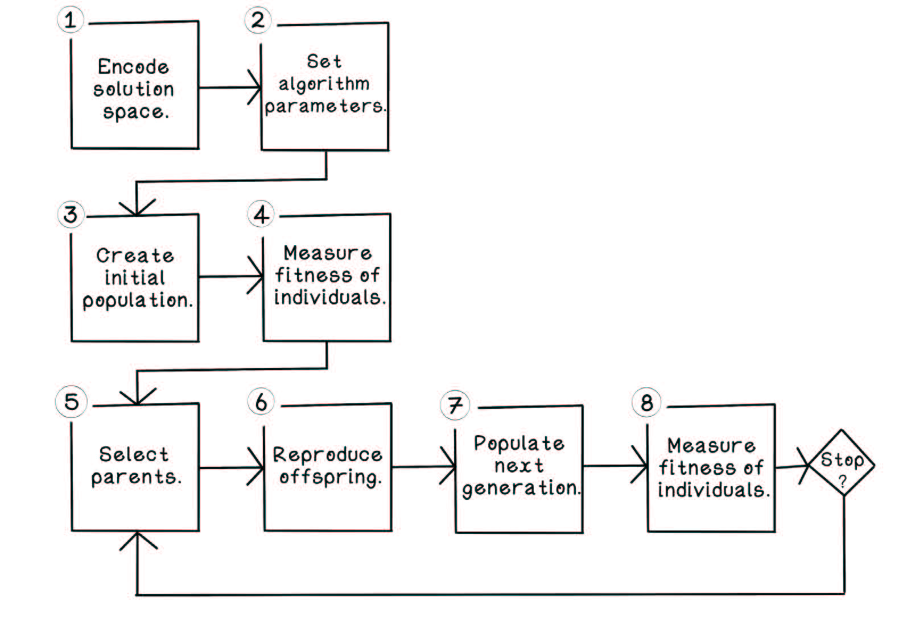
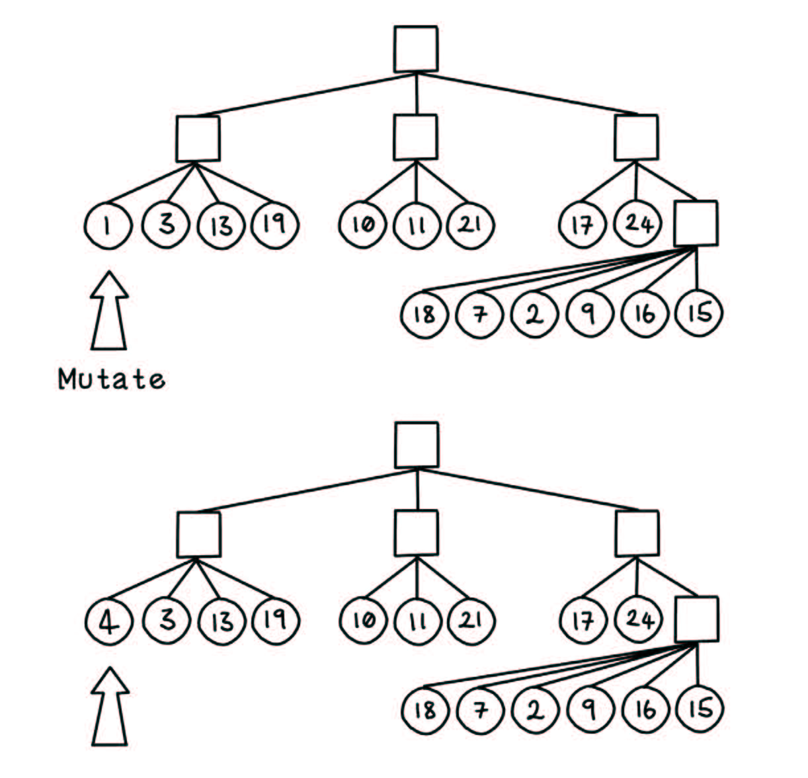

# 第5章 进化算法（高级篇）
## 5.1 进化算法的生命周期
进化算法的生命周期：
+ *创建一个种群*

+ *衡量种群中个体的适应度*

+ *根据适应度来选择亲本*

+ *由亲本繁殖个体*

+ *繁衍下一代*
    
    
    
    
图5.1 遗传算法生命周期

本章从探索其他筛选策略开始；对于任何遗传算法来说，这些独立的筛选策略一般都可以互相替换

## 5.2 其他筛选策略
以下三种筛选策略有助于减轻轮盘赌筛选法所存在的问题；每一种筛选策略都有其优点和缺点，它们会对种群的多样性产生不同程度的影响，最终影响算法对最优解的查找

### 5.2.1 排序筛选法：均分赛场
轮盘赌筛选法的一个问题是染色体之间适应度的大小存在巨大差异，这使得算法严重偏向于选择适应度更高的个体，或者给予表现不佳的个体过大的存活率。这个问题影响了种群多样性。更高的多样性意味着算法可对搜索空间进行更多的探索，但它也会使算法需要更多次的迭代来寻找最优解
:::info
排序筛选法先基于个体的适应度对种群中的所有个体进行排序，然后根据个体在种群所排的位置来计算其在轮盘上的切片大小，最后根据轮盘的概率分布解决问题
:::
在排序筛选法下，根据排序（个体所排的位置）对轮盘进行划分，每个个体被选中的机会将变得更公平（图5.3 排序筛选法示例）

   
图5.3 排序筛选法示例

图5.4比较了轮盘赌筛选法和排序筛选法。显然，排序筛选法为性能更好的解决方案提供了更大的选中概率

   
图5.4 轮盘赌筛选法和排序筛选法

### 5.2.2 联赛筛选法：分组对抗
联赛筛选法让染色体相互对抗
:::info
联赛筛选法通常先从种群中随机选择一定数量的个体，并将它们放入一个小组中，然后对给定数量的小组执行以下过程：选出每个小组中具有最高适应度得分的个体。小组规模越大，多样性水平就越低，因为每个小组中只有一个个体被选中。与排序筛选一样，从全局来看，每个个体的实际适应度得分并非其被选中的最关键因素
:::
譬如，将16个个体分为4个小组，从每个小组中选出1个个体，这样，可以从整个种群中选出4个最强壮的个体。然后，将这4个获胜的个体配对繁殖（图5.5）

   
图5.5 联赛筛选法示例
    

### 5.2.3 精英筛选法：只选最好的
:::info
精英筛选的理念是选择种群中表现最好的个体
:::
显然，精英主义有助于留住表现优秀的个体，相比于其他筛选方法，它能减少错失理想解决方案的风险。但是，精英主义的缺点是种群可能会陷入局部最优解空间；并且，随着迭代的进行，种群将逐渐丧失其多样性，也许永远找不到全局最优解
人们常将精英筛选法与轮盘赌筛选法、排序筛选法、联赛筛选法结合起来使用。其理念是，从种群中选择几个精英个体进行繁殖，同时，通过其他筛选策略生成下一代种群的其他个体（图5.6）

图5.6 精英筛选法示例

针对不同的问题空间，我们需要不同的编码方式，在有些场景下，二进制编码没有意义。下面三个小节描述了这样的场景
## 5.3 实值编码：处理真实数值
下面来看一个略有变化的背包问题。问题仍然是在背包总重量受限的情况下，选择物品装入背包中，使背包中物品的总价值最高。但是，该问题所涉及的每种备选物品都可能不少于一个单位，如表5.1所示。因为特定的物品可多次被选中，在这种情况下，二进制编码将是一个糟糕的选择。实值编码更适合表示潜在解决方案的状态

### 5.3.1 实值编码的核心概念
:::info
实值编码采用数值、字符串或符号来表示基因，并基于给定问题的上下文，自然地根据相关实值的概念来表达潜在解决方案
:::
当潜在解决方案包含无法简单地用二进制编码表示的连续数值时，不妨尝试使用实值编码。例如，由于背包中可携带的每种物品不止一个，每种物品对应的索引值不能仅指示该物品是否包括在背包内；它还必须表明背包中该物品的数量（图5.7）

图5.7 实值编码示例

因为改变了编码方法，所以现在可使用新的交叉和突变策略了。前面讨论过的二进制编码的交叉策略对实值编码来说仍然有效，但此处应以不同的方式处理突变

### 5.3.2 算术交叉：数学化繁殖
:::info
算术交叉的设计理念是使用算术运算来指导繁衍——将亲本的基因组用作表达式中的变量来进行计算。使用亲本进行算术运算所产生的结果是新的后代
:::
如果将这种策略用于二进制编码场景，则需要确保计算结果仍然属于有效解决方案。算术交叉适用于二进制编码和实值编码（图5.8）
:::warning
:bulb: 注意，这种方法会产生极其多样化的后代，这可能会引入额外的风险
:::

图5.8 算术交叉示例

### 5.3.3 边界突破
:::info
在边界突破中，从实值编码的染色体中随机选择的基因会被随机设置为下界值或上界值
:::
给定一个染色体的26个基因，算法会随机选择一个小标，并将其对应的值设置为某个预先设定的最小值或最大值。在图5.9中，原始值恰好为0，而算法会将这个值重新设置为6，也就是该物品所能取到的最大数量。对于染色体上所有基因而言，我们可为其设置相同的最大值和最小值，不过，如果对问题的上下文有更深刻的了解，则可为每个基因设置专属的最大值和最小值。
边界突破策略尝试评估单个基因对染色体的影响

图5.9 边界突破示例

### 5.3.4 算术突破
在算术突破中，从实值编码的染色体中随机选择一个基因，使其增加或减少一个很小的数值
:::warning
注意。虽然图5.10展示的例子中基因的值为整数，但图中所有的数字（包括基因的值和增加的值）都可以是小数甚至分数
:::

图5.10 算术突破示例

## 5.4 顺序编码：处理序列
现在，重新来看一下背包问题中提供的物品序列。这一次，不必决定将哪些物品装进背包，但需要将所有的物品送到一个精炼厂进行加工。在这个精炼厂中，每件物品都会被分解，以提取原材料。在这种情况下，我们不必决定是否包含某种物品，我们的选择会包含所有物品
为了让问题变得有趣，在给定每件物品的精炼时间和价值的前提下，精炼厂需要达到一个稳定的精炼效率。假设物品经过精炼后，其材料的价值与物品原本的价值大致相同。现在，该问题变成了排序问题。为了使精炼效率保持恒定，精炼厂应该按什么顺序处理这些物品？

### 5.4.1 适应度函数的重要性
背包问题转变成精炼问题以后，应该关键的区别是度量解决方案是否成功的方法。因为工厂要求达到某个给定的最小精炼效率（每小时所能精炼的物品价值），所以，设计一个准确的适应度函数对于找到最佳解决方案至关重要
在精炼问题中，给定每种物品的价值和所需的精炼时间，适应度函数必须能计算当前解决方案所能满足的精炼效率。此计算比较复杂，如果适应度函数的逻辑出现错误，将直接影响解的质量

### 5.4.2 顺序编码的核心概念
:::info
顺序编码，也被称为排序编码，将染色体表示为元素序列
:::
顺序编码通常要求对所有元素都存在于染色体中，这意味着在执行交叉和突变操作时，可能需要对新生成的染色体进行纠正，以确保没有元素丢失或重复。图5.11描述了染色体如何表示给定物品的处理顺序

图5.11 顺序编码示例

此外，在路线优化问题中，也可用顺序编码表示潜在解决方案。给定一个数量目的地，要求每个目的地至少被访问一次，算法的目标是最小化总行程；此时，可按照目的地被访问的顺序将行进路线表示为目的地的排列

### 5.4.3 顺序突变：适用于顺序编码
:::info
顺序突变：在顺序编码的染色体中，随机选择两个基因并交换它们的位置
:::
这一突变策略可确保所有元素都保留在染色体中，同时引入多样性（图5.12）

图5.12 顺序突变示例

## 5.5 树编码：处理层次结构
前面的章节表明：如果要从集合中选择元素，那么二进制编码更有效；如果解决方案需要处理真实数值，那么实值编码更有效；而如果需要确定元素在集合中的优先级和顺序，那么顺序编码更有效
现在，假设背包问题中的物品已经打包好，需要通过货车运往镇上的家庭，每辆货车可容纳特定体积的物品。现在，我们需要确定物品包裹的最佳摆放方法，以最大限度地利用每辆货车的空间

为了简单起见，将现实世界中的三维问题简化成二维问题：假设货车的体积是二维平面上的一个矩形，并且包裹也用二维矩形来描述（只考虑其宽和高），而非实际世界中的三维盒子

### 5.5.1 树编码的核心概念
树编码将染色体表示为由元素构成的一棵树。对于那些以元素的层次结构为核心的潜在解决方案来说，树编码是较为通用的。树编码甚至可表示由表达式树组成的函数。因此，树编码可用来演化程序函数，其中，函数可解决特定的问题
树编码适用于下面的这个例子：给定一辆具有特定高度和宽度的货车，需要将一定数量的包裹装在货车里。算法的目标是将包裹装入货车，并最大限度地避免空间的浪费。树编码方式可很好地表达该问题潜在解决方案
在图5.13中，根节点为节点A，代表货车从上到下的装载顺序。节点B表示同一水平线上的所有包裹，节点C和节点D与节点B类似。节点E表示在节点D所在的水平层下，垂直放置在这一区域中的包裹

图5.13 表示装车问题的树编码示例

### 5.5.2 树交叉：继承树的分支
树交叉与单点交叉类似，即选择树结构中的单个点，然后交换这个点之下的分支，并与亲本个体的副本相结合，创建后代个体，将这一过程反过来运用，可生成第二个后代个体。交叉过程所产生的后代必须经过验证——确保其为满足约束条件的有效解。如果使用多个点有助于解决问题，那么可使用多个点进行交叉（图5.14)

图5.14 树交叉示例

### 5.5.3 节点突破：更改节点的值
在节点突变中，从树编码的染色体中随机选择一个节点，将其改为某个随机选择的有效对象。在上面的案例中，给定一棵表示解决方案结构的树，可将其中一个节点所代表的包裹更改为另一个有效的包裹（图5.15）

图5.15 节点突变（树编码）示例

本章和第4章介绍了一系列编码方案、交叉方案和筛选策略。当然，也可基于当前正在解决的问题，用自己的方法代替遗传算法中的这些步骤，不断地探索和修正，使算法取得更理想的表现

## 5.6 常见进化算法
本章着重结束了遗传算法的生命周期及其关键步骤的可选替代方法。为了解决不同的问题，我们往往需要对同一算法进行改进和调整，可将更改后的算法称为算法的变体。以下是一些变体及它们的使用案例

### 5.6.1 遗传编程
遗传编程的整个流程与遗传算法的流程大体相似，主要用于生成能解决特定问题的计算机程序。上一节中描述的算法流程也适用于这一问题。在遗传编程算法中，备选解决方案的适应度可以是解决方案所生成的程序解决特定计算问题的能力——解决得越好，得分就越高。考虑到这一点，树编码对于解决这类问题会很有效，因为大多数计算机程序都是由表示操作和流程的各个节点所构成的图。程序设计的语法逻辑树是可以进化的，所以，计算机程序能通过进化来解决一个特定的问题。需要注意的一点是：这些计算机程序通常会演变成一堆让人难以理解和调试的代码

### 5.6.2 进化编程
进化编程类似于遗传编程，但这一问题的备选解决方案是预先定义好的计算机程序的固定参数，而非生成的计算机程序。如果一个程序需要对输入参数进行精细调整，并且很难确定这些参数的理想组合，那么可使用遗传算法来使这些输入参数逐步进化。在进化编程算法中，备选解决方案的适应度取决于某个预先给定的计算机程序基于该解决方案所提供的输入参数的运行表现。也许，进化编程算法可用来为人工神经网络寻找好的参数，第9章将详细讨论这一策略

## 5.7 进化算法术语表
进化算法常用术语表如下：
+ *等位基因*
+ *染色体*
+ *个体*
+ *种群*
+ *基因型*
+ *表现型*
+ *世代*
+ *探索*
+ *挖掘*
+ *适应度函数*
+ *目标函数*

## 5.8 进化算法的其他用例
现实世界中存在着更多适合使用进化算法的场景，以下用例特别有趣：
+ *调整人工神经网络中的权重*
+ *电子电路设计*
+ *分子结构仿真和设计*

## 本章小结
遗传算法能用于解决大量实际问题
不同的筛选策略各有利弊
实值编码适用于许多问题空间

顺序编码适用于需要运用元素顺序来解决问题的场景

树编码适用于需要根据元素之间的关系和结构来解决问题的场景

调整算法的各个参数对于寻找理想的解决方案很重要，并且有助于提高计算效率